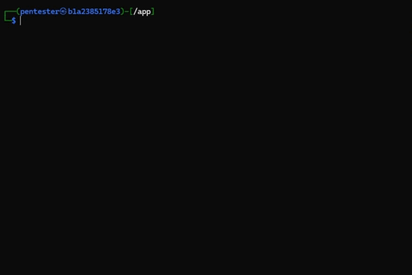

<p align="center">
  
</p>

<p align="center">
  
</p>

<p align="center">
  <strong>Penetration Testing Automation Powered by LLMs</strong>
</p>

---

**SSPentestLab** is a penetration testing tool powered by **Large Language Models (LLMs)**, designed to automate and assist in the penetration testing process. This tool is ideal for low to mid-level pentesters, offering interactive guidance, explanations, and to-do lists to aid junior users.

## 🌟 Features

- **Automated Pentesting** with GPT-4 or custom models.
- **Interactive Commands** to guide penetration testing.
- **Custom Model Integration** for flexibility.

---

## 🚀 Getting Started

SSPentestLab leverages **OpenAI's models**, specifically **GPT-4**, due to its superior performance and reasoning capabilities compared to other models. It is designed to solve easy to medium pentesting tasks.

## 🔍 General Information

### What is SSPentestLab?

**SSPentestLab** is a penetration testing tool empowered by Large Language Models (LLMs). It is built on top of the ChatGPT API and operates in an interactive mode, guiding pentesters in overall progress and specific operations.

### Why OpenAI (GPT-4)?

GPT-4 provides superior reasoning capabilities and more reliable results compared to GPT-3.5 and other models. This makes it the ideal choice for automated pentesting.

### Custom GPT Models

You can use custom GPT models. Check out: `SSPentestLab/utils/APIs/gpt4all_api.py`.

---

## 📝 Installation

### Installation via GIT with pip

1. Create a virtual environment if necessary:
   ```sh
   python -m ENVIROMENT
   source ENVIROMENT/bin/activate
   ```
2. Install the project:
   ```sh
   pip3 install git+https://innersource.soprasteria.com/demos/reto_11_gcu
   ```
3. Ensure that you have linked a payment method to your OpenAI account. Export your API key:
   - UNIX/GNU-Linux:
   ```sh
   export OPENAI_API_KEY="<your key here>"
   ```
   - Windows:
   ```sh
   setx OPENAI_API_KEY "<your key here>"
   ```
4. Test the connection:
   ```sh
   sspentestlab-connection
   ```
5. Start SSPentestLab:
   ```sh
   sspentestlab
   ```

### 🐋 Installation via Docker using Dockerfile

From the application repository, use the provided Dockerfile to create the image:
```sh
docker build -t kali-pgpt .
```
Run the container in interactive mode with privileges:
```sh
docker run -it --rm --privileged kali-pgpt
```
Export the API key:
```sh
export OPENAI_API_KEY="<your key here>"
```

### 🐋 Installation via Docker using Image (.tar)

Download image from img_docker/SSPentestLab.tar

Import the image from terminal to Docker:
```sh
docker load -i path/to/file/SSPentestLab.tar
```
Run a Docker image from the terminal by specifying the search folder, port, and image name:
```sh
docker run -it --rm -v ${env:USERPROFILE}\PentestFiles:/app -p 8000:8000 sspentestlab-app
```
When starting the container, specify the API key for GPT-4:
```sh
export OPENAI_API_KEY=<your key here>
```
To initialize SSPentestLab, call the tool with:
```sh
sspentestlab
```
To close the conteiner, use the following command:
```sh
exit
```


---

## 🎮 Usage

Run SSPentestLab using the latest model:
```sh
sspentestlab
```
To start, run:
```sh
sspentestlab --args
```

<p align="center">
  
</p>

### Available Commands

- `--help`: Show the help message.
- `--reasoning_model`: Specify the reasoning model to use.
- `--parsing_model`: Specify the parsing model to use.
- `--useAPI`: Use OpenAI API (default: True).
- `--log_dir`: Set the customized log output directory (relative path).
- `--logging`: Enable/disable log sharing (default: False).

### Interactive Commands

- `terminal`: Run custom user commands.
- `next`: Execute the next step based on test results.
- `more`: Get more details on the current step.
- `todo`: Show the to-do list (WIP).
- `discuss`: Discuss with SSPentestLab.
- `google`: Search on Google (WIP).
- `help`: Show the help message.
- `quit`: Exit the tool and save the output as a log file.

### Sub-task Handler Commands

- `brainstorm`: Brainstorm solutions for the local task.
- `discuss`: Discuss the local task.
- `continue`: Exit the subtask and continue the main testing session.

### Report and Logging

After completing the penetration testing, the user is going to be able to generate a report using an integrated function inside the main menu called `report`.

If you quit with the `quit` menu function, it will save the current session inside the `logs/sessions` folder. You will be able to load this session when freshly starting the tool again.

---

## 🧠 Custom Model Endpoints and Local LLMs

SSPentestLab supports local LLMs, optimized for GPT-4.

- To use a local GPT4ALL model:
  ```sh
  sspentestlab --reasoning_model=gpt4all --parsing_model=gpt4all
  ```
- To select a particular model with GPT4ALL, update the `module_mapping` class in `sspentestlab/utils/APIs/module_import.py`.

Follow the examples of `module_import.py`, `gpt4all.py`, and `chatgpt_api.py` to create API support for your model.